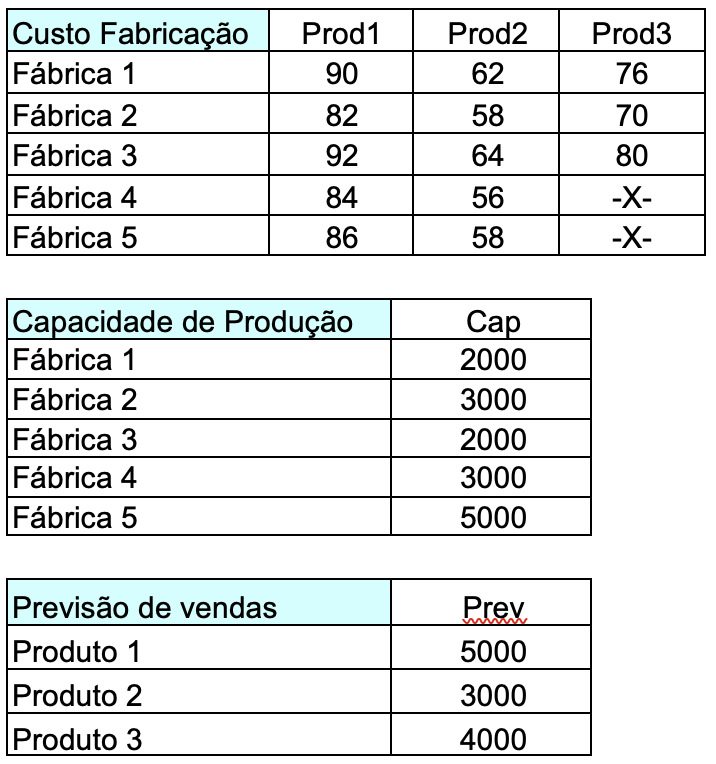

# Problem Statement (Lachtermacher, 2008)

Uma grande empresa industrial chegou a conclusão de que deve fabricar três novos produtos. Atualmente existem cinco filiais com capacidade de produção excedente. A diretoria deseja saber como alocar os novos produtos às fábricas de modo a minimizar o custo total de produção.  Obs.: As fábricas 4 e 5 não estão preparadas para fabricar o produto 3.

Os custos e a capacidade de produção, conforme a unidade fabril encontram-se nas tabelas a seguir.

# Solução
Acesse o cógido em Python [aqui](Lachtermacher2008.ipynb)

